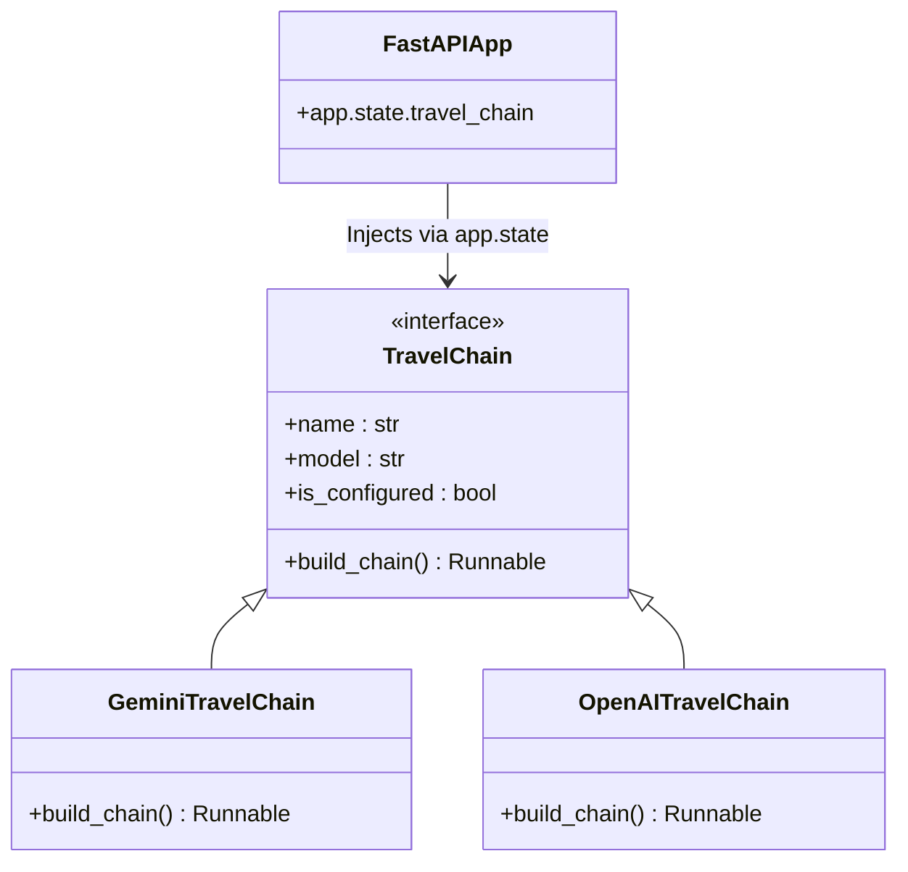

# 🌍 Agentic Travel Planner

An intelligent, production-ready AI Travel Planner built with **FastAPI**, **LangChain**, and **Gemini** (or OpenAI). It generates personalized, day-by-day travel itineraries based on destination, budget, duration, and user interests.

This project is built as a scalable sandbox, designed to evolve from a simple LangChain chain (Phase 1) into a fully autonomous Agentic workflow with external tools (LangGraph) in future phases.

---

## 🎨 UI Mockup


*The UI features a premium dark glassmorphism design with real-time markdown rendering and graceful error handling.*

---

## 🏗️ System Architecture

### Phase 1: LangChain Pipeline
Currently, the system uses a streamlined LangChain Expression Language (LCEL) pipeline. 

```mermaid
sequenceDiagram
    participant User
    participant UI as Web UI (Glassmorphism)
    participant FastAPI
    participant Chain as LangChain (LCEL)
    participant LLM as Gemini / OpenAI

    %% Chat Query Flow
    rect rgb(30, 20, 50)
        Note over User, LLM: Itinerary Generation Flow
        User->>UI: Submits Travel Preferences
        UI->>FastAPI: POST /api/chat (destination, days, budget, etc.)
        FastAPI->>Chain: invoke({preferences})
        Chain->>LLM: Prompt Template + Variables
        LLM-->>Chain: Generated Itinerary (Markdown)
        Chain-->>FastAPI: Parsed String
        FastAPI-->>UI: JSON Response { "response": "..." }
        UI-->>User: Renders Markdown UI
    end
```



### Component Architecture
The backend follows a robust **Registry Pattern** to allow seamless swapping of AI models without touching the core routing logic.



---

## 🛠 Setup & Installation

### Prerequisites
- Python 3.11+
- `uv` package manager (recommended) or `pip`

### 1. Clone & Install Dependencies
```bash
# Create a virtual environment and install dependencies
uv venv
source .venv/bin/activate
uv pip install -r requirements.txt
```

### 2. Environment Configuration
Create an environment file:
```bash
cp .env.example .env
```

**Required `.env` Variables:**
```env
# ── Server ────────────────────────────────────────────────────────────────────
HOST="0.0.0.0"
PORT=8000
LOG_LEVEL="info"

# ── LLM Provider ──────────────────────────────────────────────────────────────
# Options: "gemini" | "openai"
LLM_PROVIDER="gemini"

# ── Google Gemini ─────────────────────────────────────────────────────────────
GEMINI_API_KEY="your_gemini_api_key_here"
GEMINI_MODEL="gemini-2.5-flash-lite"

# ── Generation Settings ───────────────────────────────────────────────────────
TEMPERATURE=0.4
MAX_TOKENS=2048
```
> **Note:** We intentionally do not use `RELOAD=true` in the `.env` file to ensure stable asynchronous signal handling (Ctrl+C). Hot-reloading is handled via the CLI.

### 3. Run the Server

**For Development (Hot-Reloading):**
```bash
uvicorn main:app --reload --host 0.0.0.0 --port 8000
```

**For Production:**
```bash
python main.py
```
> The application will be available at: **http://localhost:8000**  
> Interactive API Docs: **http://localhost:8000/docs**

---

## 📡 API Documentation

### 1. Generate Itinerary
Generates a structured markdown itinerary based on user preferences.

- **Endpoint**: `POST /api/chat`
- **Content-Type**: `application/json`
- **Input Payload**:
```json
{
  "destination": "Kyoto, Japan",
  "days": 5,
  "budget": "Moderate",
  "month": "April",
  "interests": "culture, food, nature",
  "travel_style": "balanced"
}
```

**Success Response (200 OK):**
```json
{
  "response": "# 🌸 5-Day Kyoto Itinerary\n\n## Day 1: Arrival & Eastern Kyoto...\n\n(Full markdown itinerary)"
}
```

**Error Handling (503 Service Unavailable / Retries):**
The API features built-in exponential backoff for transient LLM errors (e.g. Gemini high demand). It retries transparently and gracefully fails with a user-friendly message.

### 2. Health Check
Verifies server status and the currently active AI providers.

- **Endpoint**: `GET /health`
- **Content-Type**: `application/json`

**Success Response (200 OK):**
```json
{
  "status": "ok",
  "phase": "1 — LangChain Chain",
  "llm_provider": "gemini",
  "llm_model": "gemini-2.5-flash-lite",
  "llm_configured": true
}
```

---

## 🛠 Tech Stack
- **Backend Framework**: [FastAPI](https://fastapi.tiangolo.com/) (Python)
- **AI Orchestration**: [LangChain](https://python.langchain.com/) (LCEL)
- **AI/LLM Providers**: 
  - `langchain-google-genai` (Google Gemini)
  - `langchain-openai` (OpenAI GPT models)
- **Frontend**: Vanilla HTML/CSS/JS (Dark Glassmorphism design, zero-build setup)

---

## 🔮 Future Developer Enhancements (Roadmap)

The project is structured to easily support advanced agentic capabilities in the future:

### Phase 2: Memory & Context
- **Conversation History**: Integrate LangChain memory buffers (e.g., `ConversationBufferWindowMemory`) to allow users to ask follow-up questions (e.g., *"Can we swap the museum on Day 2 for a hiking trail?"*).
- **Session Management**: Add user session IDs to keep track of concurrent user planners.

### Phase 3: Tools & LangGraph Integration
- **Live Data Tools**: Replace the static LCEL chain with a `LangGraph` agent workflow.
- **Flight & Hotel Search**: Give the agent tools (e.g., SerpAPI, Amadeus, or Google Flights tool) to fetch real-time pricing and availability.
- **Weather API**: Give the agent access to OpenWeatherMap to suggest activities based on the actual forecast for the requested month.

### Phase 4: UI/UX Improvements
- **Streaming Responses**: Implement Server-Sent Events (SSE) to stream the itinerary generation token-by-token.
- **Export Options**: Add a button to export the generated markdown to PDF or Notion.
