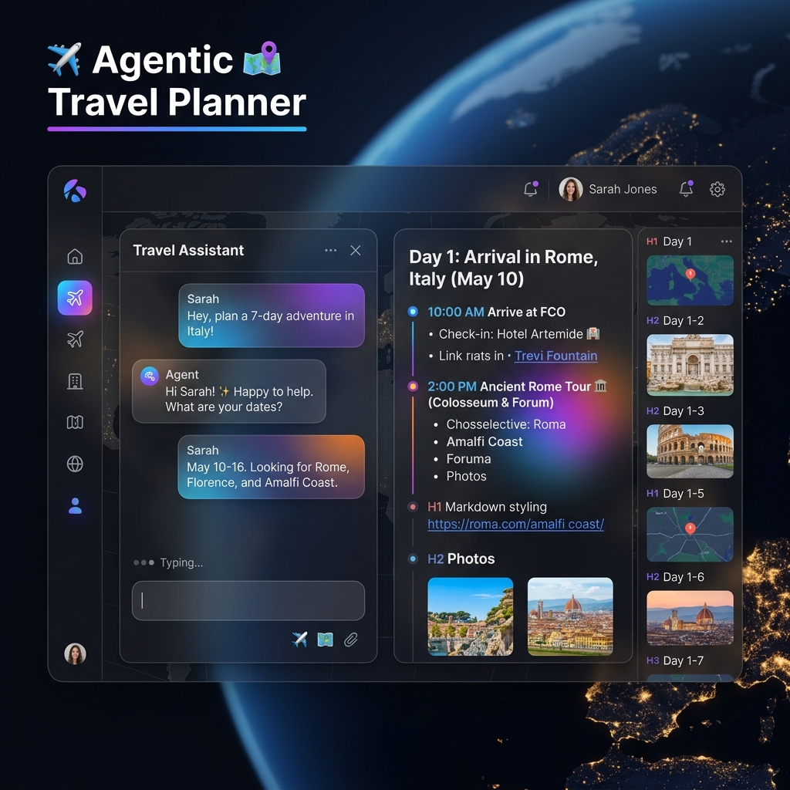

# 🌍 AI Travel Planner Enterprise

> **Phase 3 — LangGraph Multi-Agent System**  
> Production-grade AI travel planner built with **LangGraph**, **FastAPI**, **ChromaDB**, and **Google Gemini**. Real-time SSE streaming, parallel specialist agents, RAG knowledge base, human-in-the-loop, and PDF generation — all with free APIs.

---

## 🎨 UI Preview



*Dark glassmorphism UI with real-time agent pipeline visualization, live streaming output, and animated node status indicators.*

---

## 🏗️ Architecture Overview

```
User Request (POST /graph/plan/stream)
        │
        ▼
┌─────────────────────────────────────────────────────────┐
│              LangGraph StateGraph (Phase 3)             │
│                                                         │
│  🧠 planner ──► 🔍 retriever ──► ⚡ run_agents (parallel) │
│                                       │                 │
│       ┌──── flight  hotel  weather ───┘                 │
│       │     budget  restaurant  visa  currency          │
│       ▼                                                 │
│  ✍️ writer ──► 👀 reviewer ──┬─► (approved) ──────────► │
│       ▲                      └─► (rejected, loop back)  │
│       │                                                 │
│  👤 human_approval (interrupt checkpoint)               │
│       │                                                 │
│  📄 pdf_generator ──► 📧 email_sender ──► END           │
└─────────────────────────────────────────────────────────┘
        │
        ▼
  SSE stream → UI (real-time node status, streaming text)
```

### Key Concepts Implemented

| Concept | Implementation | Why It Matters |
|---------|---------------|----------------|
| **StateGraph** | `app/graph/builder.py` | Replaces linear chains — supports branching, loops, parallelism |
| **Parallel Agents** | `asyncio.gather` in `run_agents_node` | 7 agents in ~5s instead of ~35s sequential |
| **Checkpointing** | `MemorySaver` → `PostgresSaver` (path) | Pause/resume, crash recovery, human-in-the-loop |
| **Conditional Edges** | `app/graph/edges.py` | Routes state to `writer` (loop) or `human_approval` |
| **LLM-as-Judge** | `reviewer_node` with JSON scoring | Quality gate: scores 1–10, rejects below threshold |
| **Human Interrupt** | `interrupt()` + `/graph/approve` | Human reviews draft before PDF/email |
| **RAG** | ChromaDB + Gemini embeddings | Grounds LLM in real travel knowledge |
| **SSE Streaming** | `astream_events()` → text/event-stream | Real-time UI updates as each agent completes |

---

## 📁 Project Structure

```
agentic-travel-planner/
├── app/
│   ├── graph/
│   │   ├── state.py          # TravelState dict (44 fields, factory pattern)
│   │   ├── nodes.py          # 8 async node functions
│   │   ├── edges.py          # Conditional routing (approve/reject/loop)
│   │   ├── builder.py        # StateGraph wiring + compile()
│   │   └── checkpointer.py   # MemorySaver (dev) + Postgres migration path
│   ├── tools/
│   │   ├── weather_tool.py   # Open-Meteo (free, no key)
│   │   ├── currency_tool.py  # Frankfurter API (free, no key)
│   │   ├── maps_tool.py      # Nominatim/OSM (free, no key)
│   │   ├── wikipedia_tool.py # Wikipedia (free, no key)
│   │   ├── flight_tool.py    # Simulation → Amadeus sandbox
│   │   ├── hotel_tool.py     # Simulation → Amadeus hotel
│   │   ├── restaurant_tool.py# Curated → Foursquare API
│   │   ├── visa_tool.py      # Curated → Sherpa API
│   │   ├── calculator_tool.py# Pure Python budget math
│   │   ├── pdf_tool.py       # ReportLab PDF generation
│   │   └── email_tool.py     # SMTP with HTML + PDF attachment
│   ├── rag/
│   │   ├── embedder.py       # Gemini gemini-embedding-001 (3072-dim)
│   │   ├── chunker.py        # 3 strategies: recursive, markdown, fixed
│   │   ├── vectorstore.py    # ChromaDB CRUD + similarity search
│   │   └── ingestor.py       # Startup ingestion pipeline
│   ├── prompts/
│   │   ├── system_prompt.py  # Master persona + guardrails
│   │   ├── planner_prompt.py # Structured intent extraction
│   │   ├── writer_prompt.py  # Anti-hallucination synthesis
│   │   ├── reviewer_prompt.py# LLM-as-judge quality checklist
│   │   └── agent_prompts.py  # Per-specialist agent prompts
│   ├── services/
│   │   └── graph_service.py  # SSE streaming + human approval resume
│   ├── api/routes/
│   │   ├── graph.py          # POST /graph/plan/stream, POST /graph/approve
│   │   └── chat.py           # Phase 2 backward compat
│   ├── core/
│   │   ├── config.py         # Typed pydantic-settings config
│   │   └── logging.py        # JSON structured logging
│   └── server.py             # FastAPI factory + lifecycle
├── data/
│   ├── travel_knowledge/     # RAG source documents (Markdown)
│   ├── chroma_db/            # ChromaDB persisted vectors
│   └── pdfs/                 # Generated PDF output
├── static/
│   └── index.html            # Full-featured dark UI (no build step)
├── pyproject.toml            # Dependencies (uv)
└── .env                      # API keys + config
```

---

## ⚡ Quick Start

### 1. Prerequisites
- Python 3.11+
- `uv` package manager: `pip install uv`
- Google Gemini API key (free at [aistudio.google.com](https://aistudio.google.com))

### 2. Clone & Install
```bash
git clone <your-repo>
cd agentic-travel-planner

uv sync   # installs all dependencies from pyproject.toml
```

### 3. Configure Environment
Edit `.env` with your credentials:

```env
# ── Required ──────────────────────────────────────────────────
GEMINI_API_KEY="your_key_from_aistudio.google.com"
GEMINI_MODEL="gemini-2.5-flash-lite"

# ── Optional: LangSmith observability (free tier) ────────────
# Sign up at smith.langchain.com, then:
# LANGSMITH_API_KEY="your_langsmith_key"
# LANGSMITH_PROJECT="agentic-travel-planner"

# ── Optional: Email delivery (Gmail SMTP) ────────────────────
# SMTP_HOST="smtp.gmail.com"
# SMTP_PORT=587
# SMTP_USER="your@gmail.com"
# SMTP_PASSWORD="your_app_password"   # Google App Password
# SMTP_FROM="your@gmail.com"
```

### 4. Run the Server
```bash
# Development (hot-reload)
uv run uvicorn app.server:create_app --factory --host 0.0.0.0 --port 8000 --reload

# Production
uv run uvicorn app.server:create_app --factory --host 0.0.0.0 --port 8000 --workers 4
```

Open **http://localhost:8000** → full UI loads automatically.  
API docs: **http://localhost:8000/docs**

---

## 🌐 API Reference

### Phase 3 — LangGraph Multi-Agent

#### `POST /graph/plan/stream`
Stream a full multi-agent travel plan via Server-Sent Events.

```bash
curl -X POST http://localhost:8000/graph/plan/stream \
  -H "Content-Type: application/json" \
  -d '{
    "destination": "Tokyo, Japan",
    "days": 7,
    "month": "April",
    "budget": "$3000",
    "interests": "temples, sushi, technology",
    "travel_style": "balanced",
    "num_travelers": 2,
    "departure_city": "New York",
    "require_human_approval": false
  }'
```

**SSE Event Types streamed:**

| Event | Payload | When |
|-------|---------|------|
| `start` | `session_id`, `destination` | Request received |
| `node_start` | `node`, `display_name`, `progress` | Each agent starts |
| `node_end` | `node`, `status`, `output_preview` | Each agent completes |
| `agent_data` | `{flight, hotel, weather, ...}` | After parallel agents |
| `draft_ready` | `draft` | Writer produced itinerary |
| `text_chunk` | `text` | Token-by-token streaming |
| `tool_start/end` | `tool`, `input` | Tool calls in progress |
| `human_approval_required` | `session_id` | If approval enabled |
| `complete` | `final_itinerary`, `pdf_path` | All done |
| `error` | `message` | Any failure |

#### `POST /graph/approve`
Resume a paused graph after human review.

```bash
curl -X POST http://localhost:8000/graph/approve \
  -H "Content-Type: application/json" \
  -d '{
    "session_id": "your-session-id",
    "approved": true,
    "feedback": ""
  }'
```

#### `GET /graph/status/{session_id}`
Check execution status of any graph session.

#### `GET /graph/stats`
System stats — RAG document count, model info, agent list.

#### `GET /health`
```json
{
  "status": "ok",
  "phase": "3 — LangGraph Multi-Agent",
  "llm_model": "gemini-2.5-flash-lite",
  "graph_ready": true,
  "langsmith_enabled": false
}
```

### Phase 2 — Backward Compatible
| Endpoint | Description |
|----------|-------------|
| `POST /api/chat` | Simple LangChain chain (no agents) |

---

## 🛠 Tech Stack

| Layer | Technology | Cost |
|-------|-----------|------|
| **LLM** | Google Gemini 2.5 Flash Lite | Free tier available |
| **Orchestration** | LangGraph 0.2+ | Open source |
| **Embeddings** | Gemini gemini-embedding-001 (3072-dim) | Free tier |
| **Vector DB** | ChromaDB (local persistent) | Free, open source |
| **Framework** | FastAPI + Uvicorn | Free, open source |
| **PDF** | ReportLab | Free, open source |
| **Weather** | Open-Meteo API | Free, no key |
| **Currency** | Frankfurter API | Free, no key |
| **Maps** | Nominatim / OSM | Free, no key |
| **Observability** | LangSmith | Free (5K traces/month) |

---

## 🗺️ Production Migration Paths

### Checkpointing: MemorySaver → PostgreSQL
```python
# pyproject.toml: uv add langgraph-checkpoint-postgres psycopg
from langgraph.checkpoint.postgres.aio import AsyncPostgresSaver

async with AsyncPostgresSaver.from_conn_string(POSTGRES_URL) as cp:
    await cp.setup()  # Creates tables on first run
    graph = build_travel_graph().compile(checkpointer=cp)
```

### Vector Store: ChromaDB → Qdrant (production scale)
```bash
docker run -p 6333:6333 qdrant/qdrant
uv add qdrant-client langchain-qdrant
```
Then update `vectorstore.py` to use `QdrantVectorStore` — graph code unchanged.

### Real Flight/Hotel APIs (Amadeus)
```env
AMADEUS_CLIENT_ID="your_id"
AMADEUS_CLIENT_SECRET="your_secret"
```
Amadeus offers a **free sandbox** with real airline data. Swap in `flight_tool.py`.

### Observability: LangSmith
```env
LANGSMITH_API_KEY="your_key"  # smith.langchain.com — free 5K traces/month
LANGSMITH_PROJECT="agentic-travel-planner"
```
Every LLM call, token count, latency, and tool invocation becomes visible in the dashboard.

---

## 🧠 Learning Objectives (Senior AI Engineer Concepts)

This project is built to teach production AI engineering through real implementation:

| Concept | Where to Look |
|---------|--------------|
| StateGraph vs AgentExecutor | `app/graph/builder.py` + docstrings |
| Parallel agent fan-out | `app/graph/nodes.py` → `run_agents_node` |
| Conditional edge routing | `app/graph/edges.py` |
| Checkpointing & time-travel | `app/graph/checkpointer.py` |
| LLM-as-judge pattern | `app/graph/nodes.py` → `reviewer_node` |
| Human-in-the-loop | `interrupt()` in `human_approval_node` |
| RAG chunking strategies | `app/rag/chunker.py` |
| SSE streaming | `app/services/graph_service.py` |
| Tool design (docstrings matter) | `app/tools/*.py` |
| Anti-hallucination prompts | `app/prompts/writer_prompt.py` |
| Ctrl+C safety (CancelledError) | Every `asyncio.wait_for` call — never caught |
| Token cost tracking | `total_tokens_in/out` in state |

---

## 📊 Evolution: Phase 1 → Phase 3

| Feature | Phase 1 | Phase 2 | Phase 3 |
|---------|---------|---------|---------|
| LLM calls | 1 (chain) | 1+N (ReAct loop) | 8+ (graph nodes) |
| Parallelism | None | None | 7 agents concurrent |
| Memory | None | Window buffer | Checkpointed state |
| RAG | None | None | ChromaDB (34+ chunks) |
| Human-in-loop | None | None | ✅ interrupt/resume |
| PDF output | None | None | ✅ ReportLab |
| Email | None | None | ✅ SMTP |
| Streaming | None | Token stream | SSE node events |
| Observability | None | None | LangSmith (optional) |

---

## 🤝 Contributing

```bash
# Run import validation (all 28 modules)
uv run python -m pytest tests/ -v   # (when tests added)

# Verify all imports before submitting
uv run python -c "from app.server import create_app; print('✅ OK')"
```

---

*Built as a production AI learning project. Every abstraction is intentional and documented.*
